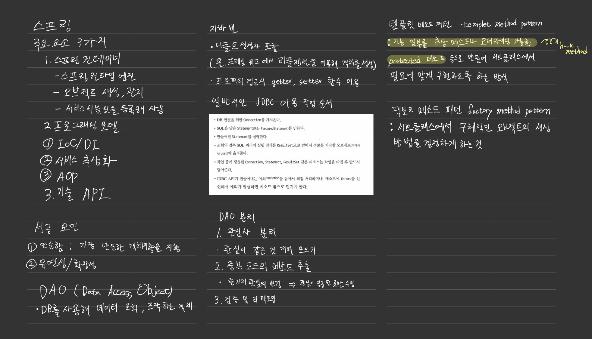

학습 날짜
---
+ 2021-01-22 (금)

학습 시간
---
+ 15:00 ~ 19:00 자가

학습 범위 및 주제
---
+ Spring Framework

동료 학습 방법
---
+ X

학습 목표
---
+ Spring Framework 교재 회독 및 정리

상세 학습 내용
---
+ 학습 내용 정리 git : [깃 허브](https://github.com/kiskim/study)   

학습 내용에 대한 개인적인 총평
---
+ 아이패드를 구매 후 처음으로 필기와 정리를 하며 공부를 진행했다. 필기를 하는 게 조금 재미있어지기 시작하는 것 같다.

다음 학습 계획
---
+ 알고리즘